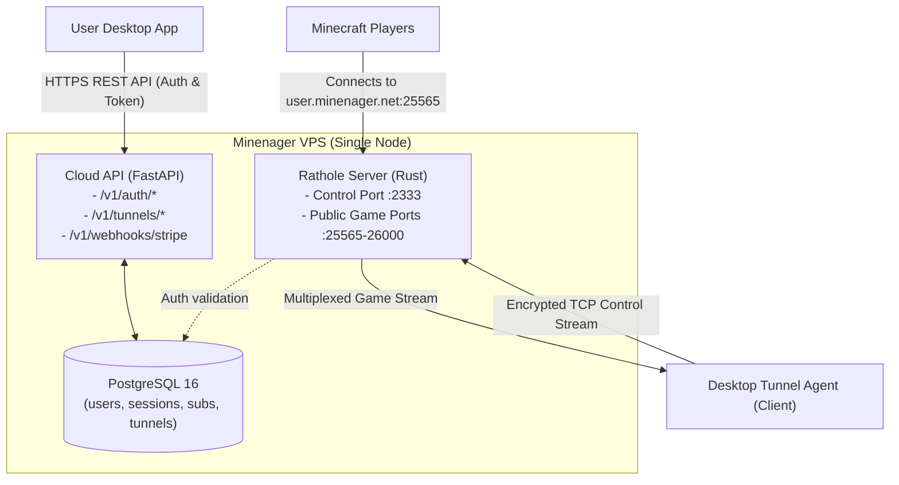

# Minenager Cloud Backend Specification

This branch (`cloud-backend`) contains the specifications, database schemas, and service definitions for the **Minenager Central Cloud Infrastructure** hosted on your VPS.

---

## 1. Scope & Responsibilities

The Cloud Backend does **not** manage local Minecraft world files. Instead, it is the central source of truth for:
1. **User Authentication & Profiles**: Central user accounts (`email`, `username`, hashed passwords, JWT token issuance).
2. **Subscriptions & Licensing**: Stripe checkout, recurring billing status, license keys, and tier enforcement (`free` vs `pro`).
3. **Tunnel Allocation & Relay Engine**: Rathole / FRP tunnel relay daemon, subdomain reservations (`*.minenager.net`), and port mapping.
4. **Relay Telemetry**: Connection tracking, heartbeats, and fair-use bandwidth monitoring.

---

## 2. VPS Service Architecture

The VPS runs a containerized stack managed via `docker-compose.yml`:



---

## 3. Database Schema Overview (PostgreSQL)

- **`users`**: `id` (UUID), `username`, `email`, `password_hash`, `tier` (`free` | `pro`), `is_active`, `created_at`.
- **`sessions`**: `id` (UUID), `user_id`, `refresh_token_hash`, `device_name`, `expires_at`.
- **`subscriptions`**: `id` (UUID), `user_id`, `stripe_customer_id`, `status` (`active` | `canceled`), `current_period_end`.
- **`tunnels`**: `id` (UUID), `user_id`, `subdomain` (e.g. `kontgo-smp`), `public_port` (e.g. `25565`), `tunnel_secret_token`, `is_online`, `last_heartbeat`.

---

## 4. Communication Protocol: Cloud ⇄ Desktop App & Frontend

The Desktop App and its frontend communicate with the Cloud Backend through three distinct channels:

### A. Authentication & Session Handshake (HTTPS / REST)
- `POST /api/v1/auth/register`: Desktop registers a new account; receives signed JWT access token.
- `POST /api/v1/auth/login`: Desktop logs in with username/email and password; receives JWT token containing `{ sub: user_id, tier: "pro" | "free" }`.
- `GET /api/v1/account/me`: Desktop validates current subscription status.

### B. Tunnel Provisioning & Heartbeat (HTTPS / REST)
When a Pro user clicks **Start Server** on desktop:
1. Desktop requests tunnel credentials:
   ```http
   GET /api/v1/tunnel/config
   Authorization: Bearer <USER_JWT>
   ```
2. Cloud API verifies `tier == 'pro'` and returns:
   ```json
   {
     "subdomain": "kontgo-smp",
     "server_address": "relay.minenager.net:2333",
     "tunnel_secret_token": "rathole_token_98fa710a...",
     "public_address": "kontgo-smp.minenager.net:25565"
   }
   ```

### C. Game Packet Relay (Multiplexed TCP / Rathole)
1. Desktop launches the embedded Rathole client using the `tunnel_secret_token`.
2. The client establishes an outbound TLS connection to `relay.minenager.net:2333`.
3. When friends join `kontgo-smp.minenager.net:25565`, the VPS relay accepts the TCP connection and streams bytes down the outbound tunnel into the desktop's local port `25565`.
