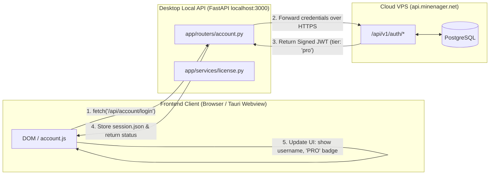

# Minenager Frontend & UI Architecture Specification

This branch (`frontend`) contains the specifications, design tokens, templates, and modular client scripts for the **Minenager User Interface**.

---

## 1. Scope & Design Philosophy

Minenager uses a zero-bundle, high-performance UI stack:
- **Zero Frontend Frameworks**: Pure ES6+ modular JavaScript and semantic HTML5 Jinja2 components. No Webpack, Vite, Node modules, or React bloat.
- **Design Tokens & Dark Zinc Theme**: CSS custom variables defined in `app/static/css/variables.css` matching modern sleek developer tools (Linear / Vercel style).
- **Sub-100ms Page Speed**: All assets are served static with zero client-side compilation overhead.

---

## 2. Directory Structure

```
app/
├── templates/
│   ├── index.html                 # Main shell & layout skeleton
│   ├── components/                # Reusable UI widgets & dialogs
│   │   ├── modal_account.html     # Login, Signup & Pro license dialog
│   │   ├── modal_installed_mods.html
│   │   └── ...
│   └── tabs/                      # Tabbed dashboard views
│       ├── tab_server.html        # Console & server controls
│       ├── tab_mods.html          # Modrinth search & mod installer
│       ├── tab_metrics.html       # Real-time CPU, RAM & TPS charts
│       ├── tab_settings.html      # Server properties & backups
│       └── tab_discord.html       # Discord bot remote control (Pro)
└── static/
    ├── css/                       # Modular CSS stylesheets
    │   ├── variables.css          # Color tokens, spacing, z-indexes
    │   ├── layout.css             # Sidebar, topbar, responsive containers
    │   ├── components.css         # Buttons, inputs, modals, badges
    │   └── tabs/                  # Tab-specific styling
    └── js/                        # Modular JavaScript modules (ES6)
        ├── account.js             # Auth state, login/signup form handling
        ├── server.js              # Server start/stop/console stream
        ├── mods.js                # Modrinth API integration
        └── ...
```

---

## 3. Communication Architecture: Frontend ⇄ Desktop App ⇄ Cloud

The frontend interacts with the system across two tiers:



### A. Local Desktop Panel Operations (Direct to `localhost:3000`)
- **Server Lifecycle**: `POST /api/server/start`, `POST /api/server/stop`
- **Real-time Console**: WebSocket or Server-Sent Events for Minecraft log streaming.
- **Local File Management**: Mod install/uninstall, world backup creation and restores.

### B. Cloud Operations (Proxied via Local Backend for Security)
The frontend does **not** store private cloud API keys or database connection strings.
1. **User Sign In / Sign Up**:
   - `account.js` submits user credentials to `/api/account/login`.
   - The local desktop server forwards the payload to the Cloud VPS API (`https://api.minenager.net/api/v1/auth/login`).
   - The cloud verifies the password hash in the VPS PostgreSQL database and returns a signed JWT.
   - The local backend caches the session in `/data/minecraft/session.json`.
2. **Dynamic UI Gating Based on Cloud Tier**:
   - When `data.tier == 'pro'`:
     - Sidebar and modal header render the amber `PRO` badge.
     - Frosted glass overlay on the **Discord Bot** tab is unlocked.
     - Public zero-portforward tunnel address (`kontgo-smp.minenager.net:25565`) is displayed.
   - When `data.tier == 'free'`:
     - Displays `FREE` badge.
     - Renders the optional "Activate Minenager Pro" license key card in the profile view.
   - When not logged in:
     - Displays `GUEST` badge and `Login` action in the sidebar.
