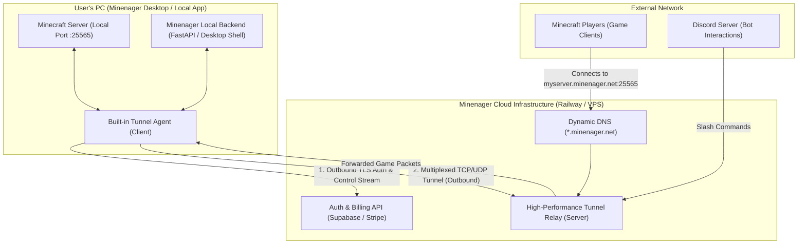

# Minenager Product Blueprint & Tunnel Architecture

This document outlines the product strategy, freemium model, monetization tiers, and a complete technical guide on how to build the **Minenager Tunnel Agent & Cloud Relay System**.

---

## 1. Product & Business Strategy

### Core Value Proposition
> **"The easiest way to host a Minecraft server on your own PC, with zero port forwarding, instant mod management, and complete Discord bot remote control."**

### Target Market
- Casual gamers & friend groups who want to play modded/vanilla Minecraft together without paying \$15–\$30/mo for game server hosting.
- Streamers and community managers looking for modern, non-clunky server management.

---

## 2. Freemium & Tier Matrix

| Feature | Free Tier (Local App) | Pro Subscription (\$3 - \$5/mo) |
| :--- | :--- | :--- |
| **Server Instances** | 1 Active Instance per machine | Multi-instance profile switching |
| **Mod & .mrpack Installer** | Full Modrinth integration | Full Modrinth integration |
| **Console & Metrics** | Real-time local dashboard | Real-time local + Remote Web Access |
| **Discord Bot Integration** | Locked | **Unlocked** (Remote commands, status, player alerts) |
| **Minenager Tunnel (Zero-Portforward)** | Manual Port Forwarding | **1-Click Custom Domain** (`myserver.minenager.net`) |
| **Cloud Backups** | Local storage only | Auto-sync to Google Drive / OneDrive / S3 |

---

## 3. High-Level Architecture Overview



---

## 4. How a Tunnel Agent is Built (Deep Dive)

### Why is an Agent Needed?
Most home internet users are behind **NAT (Network Address Translation)** or **CGNAT (Carrier-Grade NAT)** where inbound connections from friends are blocked by routers and ISPs. 

An **Outbound Tunnel Agent** solves this by initiating the connection **from the user's PC to your Cloud Relay**. Because the connection is outbound, no router ports need to be opened.

---

### Key Components of the Tunnel System

1. **The Client Agent (Built into Minenager App)**:
   - Connects to your Cloud Relay over a single persistent TCP/TLS or WebSocket connection.
   - Listens on `localhost:25565` locally.
   - Forwards inbound data from the relay to the local Minecraft server and returns responses.

2. **The Cloud Relay Server (Hosted on Railway / Cloud VPS)**:
   - Allocates a public domain/port for each authenticated Pro user (e.g. `nando-smp.minenager.net:25565` or unique port).
   - Accepts traffic from Minecraft players and pipes it down the established agent tunnel.

---

### Step-by-Step Implementation Flow

#### Phase 1: Authentication & Handshake
1. The user logs into Minenager in the app with their Pro credentials.
2. The app receives a signed JWT token containing their user ID and allocated subdomain (e.g. `user-subdomain.minenager.net`).
3. The in-app agent sends an authentication handshake over TLS to the Relay:
   ```json
   {
     "type": "AUTH",
     "token": "JWT_PRO_TOKEN_HERE",
     "local_target_port": 25565,
     "protocol": "tcp"
   }
   ```
4. The Relay validates the subscription status with the database/Stripe webhook.

#### Phase 2: Multiplexed Connection Tunneling
When a player connects to `myserver.minenager.net`:
1. The Cloud Relay receives a new incoming TCP connection from the player.
2. The Relay assigns a `stream_id` (e.g. `stream-4819`) and sends a `STREAM_OPEN` frame over the control connection to the local Agent.
3. The local Agent creates a new local socket connection to `localhost:25565` (Minecraft).
4. Any byte sent by the player is forwarded to the local Minecraft server; any byte sent by Minecraft is forwarded back to the player.

---

### Technology Choices for Building the Tunnel

There are three primary approaches depending on build vs. buy preference:

#### Option A: Embedded Rathole / FRP (Fastest & Most Battle-Tested)
- **Rathole** (written in Rust) or **FRP** (written in Go) are lightweight, memory-safe, ultra-low latency NAT traversal tools.
- **How to integrate**:
  - The Minenager app can ship with a compiled client binary (or embed it via C-bindings/subprocess).
  - Your cloud server runs the server daemon.
  - Performance: Near zero CPU overhead, handles thousands of concurrent game streams with negligible ping increase (+2–5ms).

#### Option B: Custom Async Python / Go WebSocket TCP Multiplexer
- **How to integrate**:
  - Write the agent in Python (using `asyncio` streams) or Go.
  - Uses `yamux` (Yet Another Multiplexer) or WebSocket streams to proxy raw TCP packets.
  - Advantage: 100% custom protocol logic directly inside your existing FastAPI backend.

#### Option C: WireGuard / Tailscale (Mesh Networking)
- Uses WireGuard user-space tunnels to create a direct VPN mesh between your relay node and the local machine.

---

## 5. Relay Infrastructure: Costs & Global Region Strategy

### Do you need to rent 5 VPS all over the world?
**No, you do not need 5 VPS to start.** 

#### Phase 1: Launch with 1 Central Low-Cost Relay (\$4 - \$5 / month total)
- **Why?**: When people play on a self-hosted server, 95% of friend groups live in the same country/region as the host (e.g. US-East friends playing on a US-East friend's PC).
- A single **\$4–\$5/mo VPS** (e.g., Hetzner, OVH, or a basic Railway service) has **20TB+ of included bandwidth** and a **1 Gbps port**.
- Because game packets are tiny (50–100 KB/s per player), **a single \$5 server can easily handle 500 to 1,000 concurrent Minecraft players** across dozens of active tunnels without breaking a sweat.

---

### Managed Cloud Alternatives vs. Self-Hosted Relay

| Model | Provider | Cost | Pros & Cons |
| :--- | :--- | :--- | :--- |
| **Self-Hosted Rust Relay (Recommended)** | Hetzner / OVH / Railway | **\$4 – \$5 / mo total** | **Highest margins**: 10 paying users (\$40/mo) already nets \$35/mo pure profit. Complete ownership. |
| **Managed Tunnel Services (White-label)** | Playit.gg Custom Agent / Ngrok API | \$0.05 - \$0.10 per active tunnel | Zero server maintenance, but cuts directly into your subscription profit margins. |
| **Edge Anycast (Future Multi-region)** | Fly.io / Hetzner Multi-region | \$15 – \$25 / mo total (3 regions: US, EU, LATAM) | Only needed once you scale past 100+ paying Pro subscribers. |

---

## 6. Monetization & Security Protections

1. **DDoS Protection**:
   - Cloud relays absorb connection floods and basic SYN floods, keeping the host's actual home IP address 100% hidden.
2. **Subscription Heartbeat**:
   - The relay periodically verifies active Stripe subscription status every hour. If payment expires, the tunnel gracefully disconnects with a notification in the desktop UI.
3. **Bandwidth Cap / Fair Use Policy**:
   - To keep your cloud costs low, limit tunnel throughput per user to realistic game requirements (e.g. 5–10 Mbps per active server, which is more than enough for 20+ Minecraft players).

---

## 7. Roadmap / Recommended Execution Steps

1. **Step 1: In-App Gating UI**:
   - Add a "Login / Account" modal and lock the Discord Bot tab behind a "Minenager Pro" badge.
2. **Step 2: Cloud Relay Infrastructure**:
   - Spin up a Railway or VPS service with a wildcard domain (`*.minenager.net`).
3. **Step 3: Client Agent Integration**:
   - Integrate the lightweight outbound tunnel agent into `server_process.py` / `app.py`.
4. **Step 4: Desktop Packaging**:
   - Bundle the application with Tauri or PyInstaller for a seamless 1-click Windows desktop installer.
