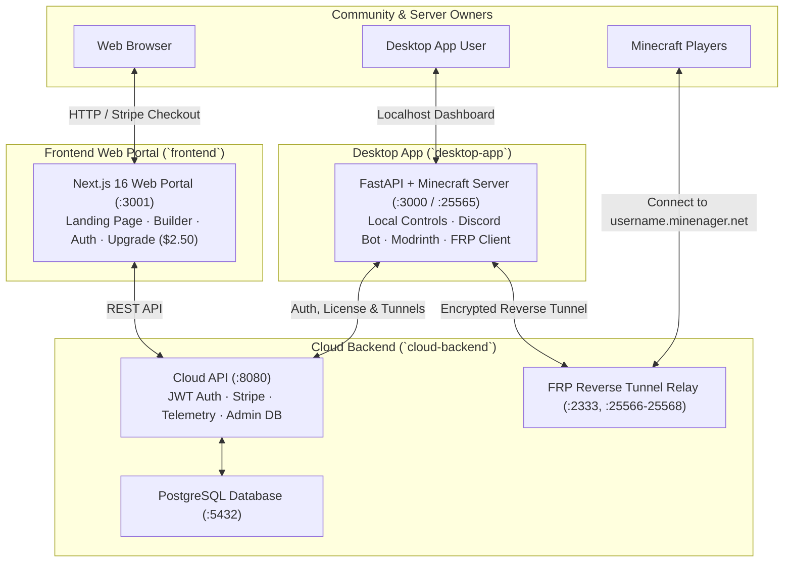

# ⛏️ Minenager

**Minenager** (Minecraft Server Manager) is the modern, zero-bloat ecosystem designed to make creating, hosting, managing, and connecting to Minecraft servers effortless on any hardware.

---

## 🏛️ Ecosystem Overview & Git Branches

The repository is structured into distinct, modular components across dedicated branches:



### 1. `main` (Ecosystem Overview & Blueprint)
The parent overview repository containing system architecture diagrams, unified roadmap, and links to all submodules and worktrees.

### 2. `frontend` (Web Landing & Upgrade Portal)
* **Location / Worktree**: `minenager-frontend`
* **Stack**: Next.js 16 (Turbopack), Tailwind CSS, Lucide React, Docker (:3001)
* **Features**:
  - High-performance marketing landing page with obsidian & cyan glassmorphic aesthetics.
  - Cloud user authentication (Sign In / Register) connected to the Cloud API.
  - Interactive Modpack & Version sandbox picker.
  - Minenager Pro ($2.50/mo) Stripe checkout session launcher.
  - Account Dashboard (`/portal`) displaying active zero-port tunnel domains.

### 3. `desktop-app` (Desktop Dashboard & Minecraft Host)
* **Location / Worktree**: `minenager-desktop`
* **Stack**: Python 3.11, FastAPI, OpenJDK Headless, Jinja2, Docker (:3000, :25565)
* **Features**:
  - Ultra-lightweight footprint (~95 MB idle RAM).
  - 1-click Minecraft server installer (Vanilla, Fabric, Quilt).
  - Real-time terminal log stream with interactive command console.
  - Modrinth mod search, automatic dependency resolver, and `.mrpack` importer.
  - Zero-portforward reverse tunnel client (powered by FRP).
  - Built-in asynchronous Discord bot (server commands, player join/leave broadcasts).
  - Local backups and storage optimizer.

### 4. `cloud-backend` (Cloud API, Database & Relay)
* **Location / Worktree**: `minenager-backend`
* **Stack**: FastAPI, PostgreSQL 16 Alpine, FRP Server (`frps`), Docker (:8080, :5432, :2333, :25566-25568)
* **Features**:
  - Centralized JWT authentication and account tier management (`free` vs `pro`).
  - Stripe checkout integration for automatic Pro licensing.
  - FRP relay server orchestrating zero-portforward Minecraft connections.
  - Developer database explorer at `/admin/db`.

---

## 🚀 Quick Start (Running All Services Locally)

### 1. Cloud Backend & Relay (Port 8080, 5432, 2333)
```bash
git checkout cloud-backend
docker compose up -d
```

### 2. Desktop Dashboard & Local Minecraft Server (Port 3000, 25565)
```bash
git checkout desktop-app
docker compose up -d
```

### 3. Frontend Web Landing & Portal (Port 3001)
```bash
git checkout frontend
docker compose up -d
```

---

## 📄 License
MIT License. Open source and built for the Minecraft community.
