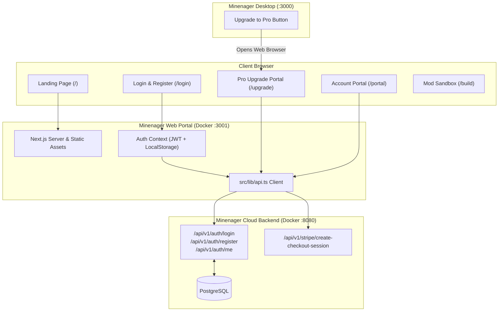

# Minenager Web Portal & Landing Page (`frontend`)

The official public web application for **Minenager** — the modern, free Minecraft server creator and desktop management app.

This service delivers the public landing page, interactive modpack builder, user authentication, subscription upgrade portal, and account dashboard.

---

## 1. Overview & Architecture

* **Framework**: Next.js 16 (Turbopack, App Router)
* **Styling**: Tailwind CSS + Custom Design Tokens (Obsidian Dark Theme, Cyan Accent, Glassmorphic Cards)
* **Icons**: Lucide React
* **Container Port**: `3001` (Internal & External mapping `3001:3001`)
* **API Integration**: Connects to `minenager-cloud-api` (`http://localhost:8080/api/v1` or `NEXT_PUBLIC_CLOUD_API_URL`)



---

## 2. Key Pages & Routes

| Route | Description |
|---|---|
| `/` | **Landing Page**: Features breakdown, comparison tables, FAQ, live server builder preview, and desktop download links. |
| `/login` | **Authentication**: Unified Sign In and Create Account view with persistent JWT session management. |
| `/upgrade` | **Pro Upgrade Portal**: Pricing ($2.50/mo), feature highlights, and direct Stripe checkout session launcher. |
| `/portal` | **User Account Dashboard**: Displays active subscription status (`FREE` vs `PRO`), custom domain assignment (`<username>.minenager.net`), and desktop setup instructions. |
| `/build` | **Interactive Mod Sandbox**: Live Modrinth and version picker sandbox to preview server presets. |

---

## 3. Environment Variables

Create or configure `.env.local`:

```bash
# Cloud Backend API URL
NEXT_PUBLIC_CLOUD_API_URL=http://localhost:8080/api/v1
```

In production, point this to your public API gateway (e.g. `https://api.minenager.net/api/v1`).

---

## 4. Running with Docker

### Docker Compose (Recommended)
```bash
docker compose up -d --build
```
The web portal will be available at `http://localhost:3001`.

### Standalone Docker Build
```bash
docker build -t minenager-frontend .
docker run -d -p 3001:3001 -e NEXT_PUBLIC_CLOUD_API_URL=http://localhost:8080/api/v1 --name minenager-landing-portal minenager-frontend
```

---

## 5. Local Development (Without Docker)

```bash
# Install dependencies
npm install

# Run dev server with Turbopack on port 3001
npm run dev -- -p 3001

# Production build
npm run build
npm run start -- -p 3001
```

---

## 6. Directory Structure

```
.
├── Dockerfile                   # Multi-stage optimized Node 20 alpine build
├── docker-compose.yml           # Compose service definition (Port 3001)
├── package.json
├── tailwind.config.ts           # Neon-cyan & Obsidian theme configuration
├── public/                      # Static assets & hero imagery
└── src/
    ├── app/
    │   ├── layout.tsx           # Global layout with AuthProvider & Navbar
    │   ├── page.tsx             # Landing page
    │   ├── globals.css          # Design tokens & glassmorphism utilities
    │   ├── login/page.tsx       # Auth view
    │   ├── upgrade/page.tsx     # $2.50/mo Pro subscription checkout flow
    │   ├── portal/page.tsx      # User profile & domain dashboard
    │   └── build/page.tsx       # Mod builder view
    ├── components/              # Modular UI components (Navbar, Hero, Pricing, etc.)
    ├── context/AuthContext.tsx  # JWT authentication state provider
    └── lib/api.ts               # Cloud backend API client
```
