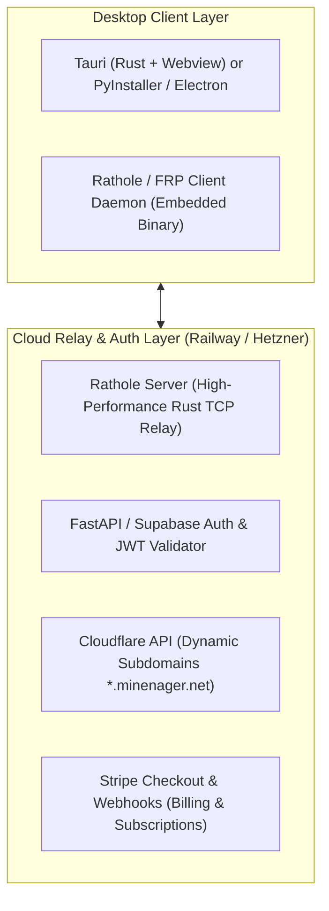
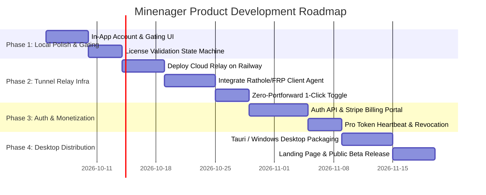

# Minenager Technology Stack & Execution Roadmap

This document outlines the **complete technology inventory** (current stack vs. future additions) and provides a **phased step-by-step engineering roadmap** for turning Minenager into a commercial product with cloud tunneling and Pro subscription gating.

---

## 1. Technology Inventory

### A. Current Technologies (Already Built)

| Layer | Technology | Purpose in Minenager |
| :--- | :--- | :--- |
| **Backend Core** | Python 3.11+ / FastAPI | High-performance asynchronous REST API and routing. |
| **Template Engine** | Jinja2 | Dynamic HTML server-side rendering for tabs and modals. |
| **Frontend Shell** | Vanilla ES6+ JavaScript (Modular) | Reactive tab routing, log buffering, live metrics, asynchronous installer calls without heavy frontend frameworks. |
| **Styling & Design** | Pure CSS3 (Design Tokens / Variables) | Modern dark-themed Zinc design system with micro-interactions, responsive flexbox/grid layout, and animated sidebar transitions. |
| **Process Management** | Python `subprocess` & `threading` | Non-blocking Minecraft Java server execution, stdin/stdout piping, graceful stopping, and thread-safe log streaming. |
| **Modding Ecosystem** | Modrinth REST API (v2) | Search, dependency resolution, version scraping, and automated `.mrpack` archive parsing. |
| **Integration** | `discord.py` / Asyncio Discord Bot | In-process bot worker for remote chat relays, server start/stop commands, and player status webhooks. |

---

### B. Future Technologies to Add

| Component | Recommended Technology | Why This Choice? |
| :--- | :--- | :--- |
| **Desktop Wrapper** | **Tauri** (or PyInstaller / Electron) | Native lightweight Windows installer (`.msi` / `.exe`), small footprint (<15 MB), system tray minimization, auto-updates. |
| **Tunnel Protocol Engine** | **Rathole** (Rust) or **FRP** (Go) | Ultra-fast memory-safe NAT traversal; near-zero CPU usage; handles hundreds of simultaneous Minecraft packet streams with sub-5ms latency. |
| **Cloud Relay Host** | **Railway** (or Hetzner Cloud VPS) | Easy scaling, persistent public IPv4/IPv6, fast bandwidth throughput for relaying game traffic. |
| **Domain & Edge Routing** | **Cloudflare DNS** (Wildcard `*.minenager.net`) | Fast Anycast DNS resolution and automated wildcard SSL certificates for web controls. |
| **Authentication & Users** | **Supabase Auth** or **Firebase Auth** | Ready-made user authentication, password resets, social logins (Discord / Google), and secure JWT tokens. |
| **Payment & Billing** | **Stripe Billing / Customer Portal** | Out-of-the-box recurring subscriptions ($3–$5/mo), card processing, tax handling, and instant cancellation webhooks. |

---

## 2. Product Roadmap & Phased Execution

---

### Phase 1: Local Product Hardening & Feature Gating
- [ ] **Locking Discord Bot & Pro Tabs**:
  - Add visual "Pro" indicators to the Discord Bot tab and advanced backup options.
  - Display an upgrade banner explaining what Minenager Pro unlocks (Zero-Portforward domain, Discord bot, remote mobile access).
- [ ] **Single Active Instance Constraint**:
  - Ensure the local storage directory (`/data/minecraft`) cleanly supports 1 active server profile for free users.

---

### Phase 2: The Railway Tunnel Relay & Agent Integration
- [ ] **Cloud Relay Setup**:
  - Deploy a containerized **Rathole** (or FRP) server instance on **Railway**.
  - Configure wildcard DNS routing for `*.minenager.net` pointing to your Railway node.
- [ ] **Client Agent Integration**:
  - Bundle a lightweight client binary inside the Minenager directory.
  - In `server_process.py`, start the tunnel client process automatically when the server goes `online` if the user is a verified Pro subscriber.
  - Display the generated shareable connection address in the UI (e.g., `friends-smp.minenager.net:25565`).

---

### Phase 3: User Authentication & Stripe Billing
- [ ] **Cloud Auth Service**:
  - Set up a lightweight cloud API for user registration and JWT token issuance.
- [ ] **Stripe Integration**:
  - Create a monthly subscription product ($3.99/mo or $29/year) in Stripe.
  - Implement Stripe Webhooks to toggle the `is_pro` status in the database.
- [ ] **Heartbeat & License Check**:
  - In-app tunnel agent sends a heartbeat every 30 minutes to ensure active subscription.

---

### Phase 4: Desktop Packaging & Public Launch
- [ ] **Windows Executable Creation**:
  - Package Minenager into a standalone `.exe` using **Tauri** (embedding Python backend) or **PyInstaller**.
  - Provide a single installer that sets up Java 17/21 requirements automatically if not present on the user's PC.
- [ ] **Marketing & Distribution**:
  - Create a clean landing page (`minenager.com`) highlighting:
    - *“Download Free for Windows”*
    - *“Play with friends in 60 seconds — No port forwarding required.”*
  - Publish showcases on Reddit (`r/admincraft`, `r/feedthebeast`, `r/Minecraft`), TikTok, and YouTube.
