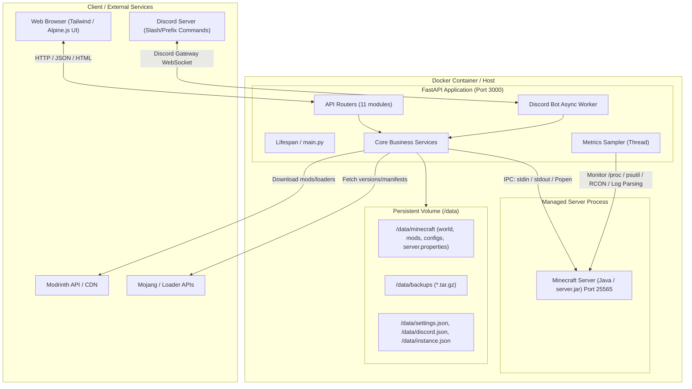

# Minenager - Architecture & API Documentation

Minenager is an all-in-one, modern web management dashboard and runtime control system for Minecraft servers (supporting Vanilla, Fabric, Forge, NeoForge, Quilt, and Modrinth `.mrpack` modpacks). It integrates server process management, Modrinth mod installations, automated backups, Discord bot integration, player moderation, resource metric tracking, and self-updating.

---

## 1. System Architecture



---

## 2. Technology Stack

### Backend & Core
* **Python 3.11**: Primary application runtime.
* **FastAPI**: Asynchronous web framework providing REST APIs and lifecycle management.
* **Uvicorn**: ASGI web server handling HTTP and WebSocket traffic.
* **Pydantic**: Request payload validation and structured settings schema.
* **Subprocess & Asyncio (`asyncio.to_thread`)**: Non-blocking orchestration of the Java Minecraft server process, log streaming, and OS operations.
* **Standard Python Libs**: `urllib.request`, `zipfile`, `tarfile`, `shutil`, `threading`, `json`.

### Frontend & UI
* **Jinja2**: Server-side templating engine for `index.html`.
* **HTML5 & Modern CSS**: Responsive dashboard with tabbed navigation and real-time state updates.
* **Chart.js / Canvas**: Real-time rendering for CPU, RAM, and TPS history graphs.
* **Fetch API**: Client-side async REST interaction.

### External Integrations & Services
* **Discord Gateway API**: Dual control plane enabling bot commands, server state checks, player querying, and automated notification webhooks (join/leave/crashes).
* **Modrinth REST API v2**: Mod search, version resolution, dependency discovery, and direct downloads.
* **Fabric / Quilt / Forge / NeoForge Maven & Meta APIs**: Server installer JAR fetching.

### Infrastructure & Deployment
* **Docker & Docker Compose**: Single-container deployment bundling Python 3.11, default headless JRE (`default-jre-headless`), Git, and Curl.
* **Volumes**:
  * `/data`: Persistent storage for Minecraft world, server files, configs, and backups.
  * `/code/app`: Application source code.
  * `/repo`: Host Git repository for in-place self-updates.

---

## 3. Directory & Module Breakdown

```text
Minecraft-Server/
├── Dockerfile                  # Container definition (Python 3.11 + Java JRE + dependencies)
├── docker-compose.yml          # Container configuration (ports 3000, 25565, and /data volume)
├── requirements.txt            # Python dependencies
├── documentation.md            # System architecture and API documentation
├── app/
│   ├── main.py                 # FastAPI initialization, lifespans, Jinja2 page route
│   ├── routers/                # REST API endpoints
│   │   ├── backup.py           # Backup creation, restoration, deletion
│   │   ├── discord.py          # Discord bot settings and notifications
│   │   ├── installer.py        # Server version / loader installation
│   │   ├── metrics.py          # Live & historical performance metrics
│   │   ├── mods.py             # Modrinth mod search, install, toggle, uninstall
│   │   ├── mrpack.py           # .mrpack modpack upload & install
│   │   ├── players.py          # Player actions (op, kick, ban, whitelist)
│   │   ├── process.py          # Server power controls (start, stop, restart, console)
│   │   ├── settings.py         # Java RAM, server.properties, world reset
│   │   ├── storage.py          # Disk usage analysis and log cleaning
│   │   └── system.py           # Self-updater and version checks
│   ├── services/               # Core business logic & subsystems
│   │   ├── backup.py           # Backup manager (.tar.gz compression & restore routines)
│   │   ├── discord_bot.py      # Discord bot daemon and command processor
│   │   ├── downloader.py       # Loader JAR downloaders (Fabric, Forge, NeoForge, etc.)
│   │   ├── metrics.py          # 60s ring-buffer metrics sampler
│   │   ├── modrinth.py         # Modrinth API client & mod file manager (.disabled toggle)
│   │   ├── mrpack.py           # .mrpack zip extractor, manifest parser, overrides applier
│   │   ├── players.py          # Player permissions, banlists, and live list parser
│   │   ├── server_process.py   # Subprocess controller, log capture, stdin command sender
│   │   ├── settings.py         # server.properties & settings.json read/write manager
│   │   ├── storage.py          # Directory size scanner & log cleanup
│   │   └── updater.py          # Git-based self updater
│   ├── static/                 # CSS stylesheets, client scripts, icons
│   └── templates/              # Jinja2 HTML templates (index.html, modals, tabs)
└── data/                       # Mounted persistent storage for Minecraft & application data
```

---

## 4. API Endpoints Reference

### 🌐 Main UI Route
| Method | Path | Description |
| :--- | :--- | :--- |
| `GET` | `/` | Serves the main HTML dashboard with initial server and system context |

---

### 🖥️ Server Process & Controls (`/api/server`)
| Method | Endpoint | Description | Payload / Params |
| :--- | :--- | :--- | :--- |
| `POST` | `/api/server/start` | Starts the Minecraft server process | None |
| `POST` | `/api/server/stop` | Sends `stop` command and terminates process cleanly | None |
| `POST` | `/api/server/restart` | Restarts the server process | None |
| `GET` | `/api/server/status` | Returns server state (`online`, `offline`, `starting`) & uptime | None |
| `POST` | `/api/server/command` | Sends a console command directly to server stdin | `{"command": "string"}` |
| `GET` | `/api/server/logs` | Fetches terminal logs since specified index | `?start_index=0` |

---

### 🧩 Mod Management (`/api/mods`)
| Method | Endpoint | Description | Payload / Params |
| :--- | :--- | :--- | :--- |
| `GET` | `/api/mods/versions` | Fetches available Minecraft versions | None |
| `GET` | `/api/mods/loaders` | Fetches supported mod loaders list | None |
| `GET` | `/api/mods/search` | Searches Modrinth mods | `?q=&version=&loader=&limit=20` |
| `GET` | `/api/mods/installed` | Lists installed mods with filenames, sizes, and enabled status | None |
| `POST` | `/api/mods/install` | Installs mod by Modrinth project ID or slug | `{"project_id_or_slug": "...", "mc_version": "...", "loader": "..."}` |
| `POST` | `/api/mods/uninstall` | Deletes a mod JAR file from `mods/` | `{"filename": "mod.jar"}` |
| `POST` | `/api/mods/toggle` | Toggles mod between enabled (`.jar`) and disabled (`.jar.disabled`) | `{"filename": "mod.jar"}` |

---

### 📦 Modpack & Installer (`/api/installer` & `/api/mrpack`)
| Method | Endpoint | Description | Payload / Params |
| :--- | :--- | :--- | :--- |
| `GET` | `/api/installer/loader-versions`| Gets compatible loader build versions | `?version=1.20.1&loader=fabric` |
| `POST` | `/api/installer/install` | Installs/generates target server JAR | `{"loader": "fabric", "mc_version": "1.20.1", "loader_version": "..."}` |
| `GET` | `/api/installer/instance` | Gets installed instance metadata | None |
| `GET` | `/api/mrpack/instance` | Gets current `.mrpack` instance details | None |
| `POST` | `/api/mrpack/upload` | Uploads binary `.mrpack` archive, extracts, and downloads dependencies | Binary file in request body |

---

### 👥 Player Management (`/api/players`)
| Method | Endpoint | Description | Payload / Params |
| :--- | :--- | :--- | :--- |
| `GET` | `/api/players` | Returns online players, OPs, whitelist, and ban lists | None |
| `POST` | `/api/players/action` | Executes moderation action (`op`, `deop`, `kick`, `ban`, `pardon`, `whitelist_add`, `whitelist_remove`) | `{"action": "...", "player": "...", "reason": "..."}` |

---

### 💾 Backup Management (`/api/backups`)
| Method | Endpoint | Description | Payload / Params |
| :--- | :--- | :--- | :--- |
| `GET` | `/api/backups` | Lists existing `.tar.gz` backups and active backup status | None |
| `POST` | `/api/backups/create` | Triggers non-blocking world/server backup creation | None |
| `POST` | `/api/backups/restore` | Stops server, extracts backup archive, and restarts server | `{"filename": "backup_*.tar.gz"}` |
| `POST` | `/api/backups/delete` | Deletes a backup archive | `{"filename": "backup_*.tar.gz"}` |

---

### ⚙️ Settings & Storage (`/api/settings` & `/api/storage`)
| Method | Endpoint | Description | Payload / Params |
| :--- | :--- | :--- | :--- |
| `GET` | `/api/settings` | Gets memory limits, JVM flags, auto-start, and `server.properties` | None |
| `POST` | `/api/settings` | Updates JVM/server settings and saves `server.properties` | `{"ram_gb": 4, "autostart": true, "properties": {...}}` |
| `POST` | `/api/settings/delete-world`| Deletes `world/`, `world_nether/`, and `world_the_end/` directories | None |
| `POST` | `/api/settings/reset` | Resets all Minecraft data back to a clean state | None |
| `GET` | `/api/storage` | Returns disk breakdown (World, Mods, Backups, Logs, Free Space) | None |
| `POST` | `/api/storage/clean-logs`| Cleans `.log.gz` and crash dump files to free space | None |

---

### 📈 Metrics & Telemetry (`/api/metrics`)
| Method | Endpoint | Description | Payload / Params |
| :--- | :--- | :--- | :--- |
| `GET` | `/api/metrics/live` | Returns instant snapshot of CPU%, RAM MB, Host RAM, and TPS | None |
| `GET` | `/api/metrics/history` | Returns the rolling 60-second time-series metric data buffer | None |

---

### 🤖 Discord Integration (`/api/discord`)
| Method | Endpoint | Description | Payload / Params |
| :--- | :--- | :--- | :--- |
| `GET` | `/api/discord` | Returns masked Discord bot configuration and connection status | None |
| `POST` | `/api/discord` | Saves bot token, channel ID, roles, notification flags, and reloads bot | `{"enabled": true, "token": "...", "channel_id": "...", ...}` |
| `POST` | `/api/discord/test` | Sends a test notification embed to configured Discord channel | None |

---

### 🔄 System & Updater (`/api/system`)
| Method | Endpoint | Description | Payload / Params |
| :--- | :--- | :--- | :--- |
| `GET` | `/api/system/version` | Returns current Git commit hash and app version | None |
| `GET` | `/api/system/check-update`| Checks remote repository for new commits | None |
| `POST` | `/api/system/update` | Pulls updates (`git pull origin main`) and restarts services | None |
