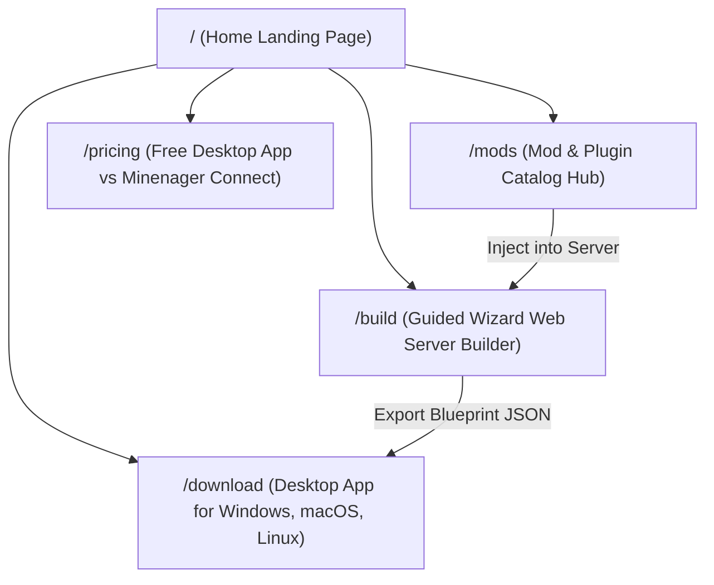

# Minenager - Product Specifications & Landing Page Architecture

## 1. Brand Identity & Business Model

### 🎯 Slogan & Core Message
> **"Build it. Own it."**

* **The Vision**: Give users 100% free, unrestricted access to the best Minecraft server desktop app and web configurator. No paywalls on core features, no memory restrictions, and no artificial limitations on self-hosting.
* **The Business Model (Freemium Zero-Friction Hosting)**:
  * **100% Free Core Desktop App & Web Builder**: Free desktop runtime, mod installer, backup engine, Discord bot, and web configurator. Users can run it on their own machines or local LAN without paying a single cent.
  * **Paid Minenager Cloud Connect Subscription**: Solves the #1 biggest headache for self-hosters: **Port forwarding, CGNAT, dynamic IPs, and server exposure.**
    1. **Instant Zero-Config Tunneling & Custom DNS/Domain** (`yourserver.minenager.link` or custom domains, with built-in DDoS protection and no port forwarding required).
    2. **Automated Cloud Backups** (Offsite encrypted snapshots to Minenager Cloud storage with 1-click restore).
    3. **Discord Bot Cloud Bridge / Co-Pilot** (Always-on Discord integration without hosting bot tokens or keeping local webhooks exposed).
    4. **Smart Crash Diagnostic & Mod Doctor** (Automated conflict resolution and AI log analysis).

---

## 2. Website Navigation & Page Structure



---

## 3. Desktop Application Architecture & Onboarding Flow

```mermaid
flowchart TD
    Install["Desktop App First Launch"]
    WizardChoice{"First Time User?"}
    Wizard["Guided Server Creation Wizard (Step 1 -> 4)"]
    Bypass["Bypass / Skip Setup"]
    Dashboard["Main Server Dashboard Manager"]
    ModTab["Mod Catalog Studio Tab (1-Click Install)"]

    Install --> WizardChoice
    WizardChoice -->|Yes (Default)| Wizard
    WizardChoice -->|Skip / Advanced| Bypass
    Wizard --> Dashboard
    Bypass --> Dashboard
    Dashboard --> ModTab
```

### 🖥️ 3.1. Desktop App User Experience & Screen Flow
1. **First-Time Install Onboarding**:
   * Launches the **Guided Creation Wizard** by default to help gamers and non-technical users set up their first Minecraft server in 4 simple steps.
   * Includes a visible **"Skip to Dashboard"** bypass for experienced administrators or users importing an existing `minenager-blueprint.json`.
2. **Main Dashboard Manager**:
   * Once initialized, the app opens the full **Server Dashboard Manager**.
   * Contains dedicated workspace tabs:
     * **Console & Process Controls**: Live terminal output, power buttons, stdin command bar.
     * **Mod Catalog Studio**: Live browsing and 1-click installation directly from Modrinth & Hangar.
     * **Performance Telemetry**: Live CPU, RAM, and TPS monitors.
     * **Safe Backups**: Local `.tar.gz` snapshots and cloud sync.
     * **Player Management**: OP, kick, ban, and whitelist controls.

---

## 4. Detailed Website Page Breakdown

### 🏠 4.1. Landing Page (`/`) — Split-Screen Hero & Demo Builder
* **Left Column**: Headline (*"Build it. Own it."*), consumer-friendly copy, **`[Download Desktop App]`** CTA, and trust badges (*No Port Forwarding*, *Modrinth & Hangar*, *1-Click Safe Backups*).
* **Right Column**: **Demo Builder** widget with live Minecraft version/loader dropdowns, server-side mod search across Modrinth & Hangar with real mod logos, and 1-click **Export Blueprint** action.
* **Secondary Sections**: "Why Selfhost Using Minenager" comparison matrix, transparent pricing tiers, multi-platform OS download cards (Windows, Mac, Linux), and 3-step setup guide.

### 🛠️ 4.2. Guided Web Server Builder (`/build`)
An interactive, 4-step progressive wizard that guides users through creating a custom server setup:
1. **Step 1: Core Engine & Loader**:
   * Minecraft version selector (Release versions).
   * Mod Loader selection with descriptive cards (Vanilla, Fabric, NeoForge, Forge, Paper, Quilt).
   * Compatible loader build resolution.
2. **Step 2: Add Superpowers & Mods**:
   * Live search across **Modrinth** and **Hangar** with strict server-side validation.
   * Real mod logo pictures and category filters.
   * 1-click Add/Remove toggles and active mod counters.
3. **Step 3: Hardware & Performance Config**:
   * RAM allocation slider with dynamic memory recommendations based on mod count.
   * View Distance slider with RAM & network impact analysis.
   * Simulation Distance slider with CPU single-thread tick (TPS) impact analysis.
   * Difficulty, Gamemode, PvP, Hardcore, and GeyserMC Bedrock crossplay toggle.
4. **Step 4: Launch Card & Blueprint Export**:
   * Visual server instance card summary.
   * **`[Export Blueprint JSON]`** and **`[Copy Blueprint]`** actions.

### 🧩 4.3. Mod & Plugin Catalog Hub (`/mods`)
* Standalone full-width catalog for players to quickly browse, search, and verify if their favorite mods or plugins are supported on Minenager.
* Search bar, category filter pills, real mod avatars, download popularity metrics, and direct link to inject into the builder.

### 💳 4.4. Pricing Model (`/pricing`)

| Feature | **Community Core (Desktop App)** | **Minenager Connect (Starter)** | **Minenager Connect (Pro)** |
| :--- | :--- | :--- | :--- |
| **Price** | **100% FREE** | **\$2.50 / month** | **\$4.00 / month** |
| **Desktop Server App** | Full Unrestricted Access | Full Unrestricted Access | Full Unrestricted Access |
| **RAM & CPU Limits** | Unlimited (Uses your computer) | Unlimited (Uses your computer) | Unlimited (Uses your computer) |
| **Mod & Plugin Manager**| Modrinth & Hangar | Modrinth & Hangar | Modrinth & Hangar |
| **Internet Access / Tunnel**| Manual Port Forwarding / LAN | **1-Click Secure Cloud Tunnel (No port forward)** | **High-Bandwidth Global Edge Tunnel** |
| **Custom Domain / DNS** | Manual Dynamic DNS / IP | `yourname.minenager.link` | **Custom Domain (`mc.yourclan.com`)** |
| **DDoS Protection** | None (Home IP exposed) | **Included (Masked IP)** | **Enterprise DDoS Shield** |
| **Cloud Backups** | Local disk only | 10 GB Encrypted Cloud Storage | 50 GB Encrypted Cloud Storage |
| **Smart Mod Doctor (AI)** | Community Discord | Basic Log Analyzer | Real-Time Mod Conflict Diagnostic |
| **Active Servers** | Unlimited Local | 1 Public Tunnel Server | Up to 3 Public Tunnel Servers |

---

## 5. UI/UX Design System & Frontend Architecture

### 🛠️ Technology Stack
* **Framework**: Next.js (App Router / React 19 / TypeScript) with Tailwind CSS.
* **Icons**: **Lucide React** vector icons (Clean 1.5px/2px stroke SVGs).
* **Strict Iconography Rule**: ZERO emojis across UI elements, all visual indicators are SVG vector icons.
* **Official Color Palette**: Deep Navy Obsidian (`#060913`), Slate Surface (`#0B1120`), Neon Cyan (`#06B6D4`), and Warm Amber (`#F59E0B`).
